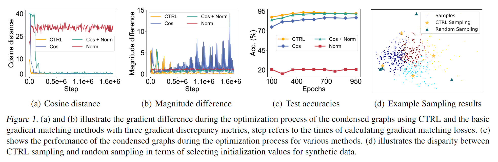

# CTRL
Pytorch implementation of "Two Trades is not Baffled: Condense Graph via Crafting Rational Gradient Matching"




## Run the code
To get the condensed graph, run the following command:
'''
'''

## Requirements
Please see [environment](/environment.yaml).

Run the following command to install:
```
conda env create -f environment.yaml
```

## Cite 
If you find this work to be useful, please cite our paper.
'''
'''
